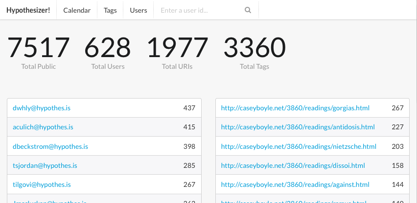

# hypothesizer

Hypothesize about your Hypothes.is installation...hypothetically...

Hypothesizer uses the public Hypothes.is API to pull in annotations (and their
metadata) and give you visibility into its current state, history, and usage.

### Usage
 - edit import.py and point it to a CouchDB (or Cloudant) database
 - couchapp push . http://...that-couchdb-url
 - open http://...that-couchdb-url/_design/hypothesizer/_rewrite/index.html
 - read the numbers :smiley_cat:

### Looks like this

### Atom Feeds

Hypothesizer now includes [Atom feeds](http://tools.ietf.org/html/rfc4287)!

 - /atom
 - /users.atom/{user}{/year}{/month}{/day}

### License

[BSD](http://choosealicense.com/licenses/bsd-2-clause/)
